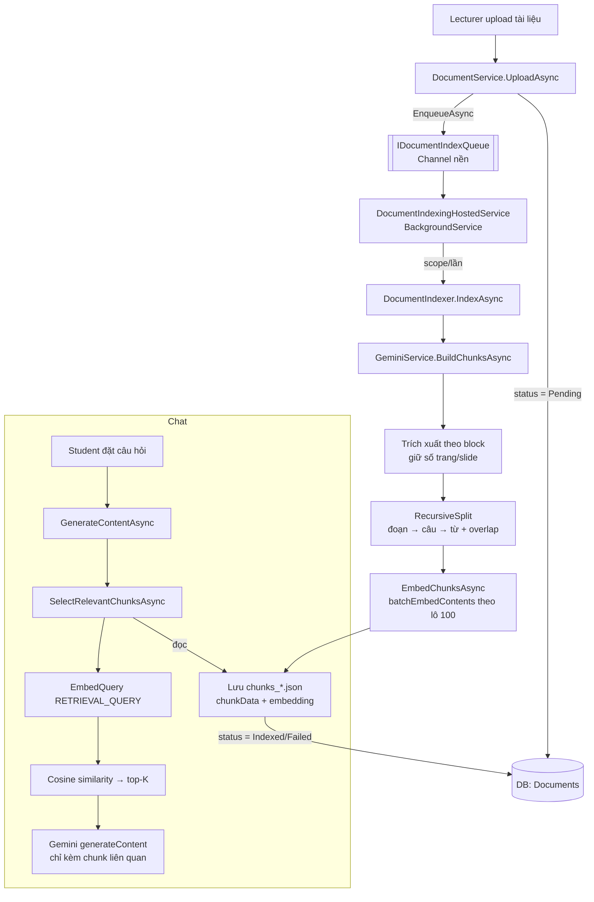

# Logic Chunking & RAG — EduQuest

Tài liệu này mô tả cách hệ thống **cắt tài liệu thành chunk, tạo embedding, và truy hồi (retrieval)** để trả lời chat. Dùng để review lại logic sau đợt tối ưu.

> TL;DR: Upload → hàng đợi nền → trích xuất text (giữ số trang) → **recursive splitter** → **embed TẤT CẢ chunk** (Gemini `text-embedding-004`) → lưu `chunks_*.json`. Khi chat → embed câu hỏi → **cosine top-K** → chỉ đưa chunk liên quan cho LLM.

---

## 1. Kiến trúc tổng thể



---

## 2. Các file liên quan

| File | Vai trò |
|------|---------|
| [BussinessLayer/DTOs/DocChunk.cs](BussinessLayer/DTOs/DocChunk.cs) | Model 1 chunk: `Index`, `Text`, `Page`, `Embedding`. Dùng cho cả runtime lẫn JSON. |
| [BussinessLayer/Services/GeminiService.cs](BussinessLayer/Services/GeminiService.cs) | Trích xuất, splitter, embedding, retrieval, gọi Gemini. |
| [BussinessLayer/Services/Indexing/DocumentIndexQueue.cs](BussinessLayer/Services/Indexing/DocumentIndexQueue.cs) | Hàng đợi nền (Channel) + `DocumentIndexRequest`. |
| [BussinessLayer/Services/Indexing/DocumentIndexer.cs](BussinessLayer/Services/Indexing/DocumentIndexer.cs) | Pipeline index 1 tài liệu (chunk→embed→lưu→status). |
| [BussinessLayer/Services/Indexing/DocumentIndexingHostedService.cs](BussinessLayer/Services/Indexing/DocumentIndexingHostedService.cs) | Worker nền đọc queue + recovery lúc khởi động. |
| [BussinessLayer/Services/ChunkSettingsService.cs](BussinessLayer/Services/ChunkSettingsService.cs) | Đọc/ghi cấu hình `MaxWords`/`OverlapWords` (Admin chỉnh). |
| [BussinessLayer/Services/DocumentService.cs](BussinessLayer/Services/DocumentService.cs) | Upload → `TriggerBackgroundProcessing` → enqueue. |

---

## 3. Pipeline index (chạy nền)

### 3.1. Đưa vào hàng đợi
Sau khi lưu file + tạo record (status `Pending`), `DocumentService` gọi `TriggerBackgroundProcessing` → `IDocumentIndexQueue.EnqueueAsync(...)`. **Không** còn `Task.Run` fire-and-forget như trước.

### 3.2. Trích xuất theo block (giữ metadata trang)
`GeminiService.ExtractBlocksAsync` trả về danh sách `(Page, Text)`:
- **PDF**: duyệt từng trang (PdfPig), tách đoạn theo dòng trống, gắn `page.Number`. **Không** chèn marker `--- Trang N ---` vào text (số trang nằm ở metadata).
- **PPTX**: mỗi slide → 1 block, `Page` = số slide.
- **DOCX**: tách theo thẻ `<w:p>` (đoạn văn), `Page = null`.
- **TXT**: tách đoạn theo dòng trống, `Page = null`.

> Nếu không rút được text (vd PDF scan ảnh) → không có block → tài liệu bị đánh dấu `Failed`; khi chat sẽ gửi thẳng file PDF cho Gemini đọc.

### 3.3. Recursive splitter — `RecursiveSplit`
Đóng gói các block thành chunk **không vượt `MaxWords`**, có **overlap** giữa các chunk:
1. Mỗi block được chia thành các **unit** ≤ `MaxWords` theo thứ tự ưu tiên: **đoạn → câu (`(?<=[.!?…])\s+`) → từ** (chỉ cắt cứng theo từ khi 1 câu vẫn quá dài, hiếm — PDF lỗi).
2. Gom unit vào chunk hiện tại tới khi vượt `MaxWords` thì "chốt" chunk.
3. Chunk mới được **gieo overlap** = `OverlapWords` từ cuối chunk trước (giữ ngữ cảnh liền mạch).
4. `Page` của chunk = số trang của nội dung **mới** đầu tiên đưa vào chunk đó.
5. `CleanText`: bỏ ký tự điều khiển, gộp khoảng trắng.

Ràng buộc an toàn: `MaxWords ≥ 50`, `0 ≤ OverlapWords < MaxWords` (nếu vi phạm sẽ tự kẹp lại).

### 3.4. Embed TẤT CẢ chunk — `EmbedChunksAsync`
- Gọi Gemini **`batchEmbedContents`** theo lô **100 chunk/lần**, model **`gemini-embedding-001`**, `taskType = RETRIEVAL_DOCUMENT`.
- Có **retry + backoff** khi gặp `429`/`5xx` (`PostWithRetryAsync`).
- Gán vector vào `DocChunk.Embedding`.

> **Khác biệt lớn so với bản cũ:** trước đây chỉ embed **1 chunk đầu tiên** và API gọi sai (`:embedText` kiểu PaLM cũ) → luôn `null`. Giờ embed **toàn bộ** bằng API Gemini đúng (`embedding.values`).

### 3.5. Lưu file & cập nhật trạng thái
Ghi `wwwroot/uploads/chunks_{StoredFileName}.json` rồi set status `Indexed` (hoặc `Failed` nếu lỗi/không có chunk).

---

## 4. Định dạng `chunks_*.json`

```jsonc
{
  "documentId": 12,
  "savedAt": "2026-07-25T10:00:00Z",
  "savedBy": 3,
  "embeddingModel": "gemini-embedding-001",
  "dim": 3072,
  "chunkCount": 42,
  "embeddedCount": 42,

  // Tương thích UI cũ (trang Chunks & Embedding):
  "chunks": ["nội dung chunk 1", "nội dung chunk 2", "..."],
  "embedding": [0.01, -0.02, "... (vector của chunk đầu, để preview)"],

  // Trường MỚI dùng cho retrieval:
  "chunkData": [
    { "Index": 0, "Text": "...", "Page": 1, "Embedding": [/* 768 số */] },
    { "Index": 1, "Text": "...", "Page": 1, "Embedding": [/* ... */] }
  ]
}
```

- `chunks` + `embedding` giữ nguyên để **trang UI cũ không vỡ**.
- `chunkData` là nguồn cho tìm kiếm ngữ nghĩa.
- File cũ **chỉ có `chunks`** vẫn đọc được (fallback không embedding).

---

## 5. Retrieval khi chat — `GenerateContentAsync` → `SelectRelevantChunksAsync`

1. Với mỗi tài liệu đính kèm, đọc `chunks_*.json` cạnh file (`TryLoadSavedChunks`).
2. **Nếu có embedding**: embed câu hỏi (`taskType = RETRIEVAL_QUERY`) → tính **cosine similarity** với mọi chunk → lấy **top-K = 6** liên quan nhất.
3. **Nếu tài liệu chưa index** (chưa có JSON/embedding): fallback lấy **4 chunk đầu**/tài liệu; PDF không có text → gửi nguyên file PDF.
4. Trần tổng **8 phần** đính kèm để tránh payload quá lớn.
5. Mỗi chunk gửi kèm header `[Tài liệu {tên} - Trang {n}]` để mô hình biết nguồn.

> **Khác biệt lớn:** bản cũ luôn nhồi **8 chunk ĐẦU** bất kể câu hỏi (không có tìm kiếm). Giờ chỉ đưa chunk **liên quan** → trả lời đúng trọng tâm, tiết kiệm token.

Hằng số cấu hình trong `SelectRelevantChunksAsync`: `topK = 6`, `fallbackPerDoc = 4`, `maxParts = 8`.

---

## 6. Cấu hình

### 6.1. Kích thước chunk (Admin → AI Chunking)
`ChunkSettingsDto` lưu ở `wwwroot/uploads/chunk_settings.json`:

| Tham số | Mặc định | Khoảng | Ý nghĩa |
|---------|----------|--------|---------|
| `MaxWords` | 300 | 100–1000 | Số **từ** tối đa mỗi chunk (~ số token). |
| `OverlapWords` | 50 | 10–200 | Số **từ** gối đầu giữa 2 chunk liền kề. |

> Gợi ý: 300 từ / overlap 50 (~16%) là hợp lý cho RAG. Chunk nhỏ hơn → truy hồi chính xác hơn nhưng nhiều mảnh; chunk lớn hơn → ít mảnh nhưng "loãng".

### 6.2. Gemini (từ biến môi trường `.env`)
| Key | Mặc định trong code | Ghi chú |
|-----|---------------------|---------|
| `Gemini__ApiKey` | — | Bắt buộc để tạo embedding & chat. |
| `Gemini__Model` | `gemini-2.5-flash` | Model chat/summary (còn dùng; có thể nâng lên `gemini-3.5-flash`/`gemini-3.6-flash`). |
| `Gemini__ApiUrl` | `.../v1beta/models/` | Base URL. |
| `Gemini__EmbeddingModel` | `gemini-embedding-001` | Model embedding ổn định (tới 2028, mặc định 3072 chiều). `text-embedding-004` **đã bị shut down 14/01/2026**. |

---

## 7. Độ bền (background)

- **Hàng đợi + hosted service**: index tách khỏi luồng HTTP; nhiều upload xếp hàng xử lý tuần tự (`SingleReader`).
- **Recovery lúc khởi động**: `DocumentIndexingHostedService.RecoverPendingAsync` nạp lại mọi tài liệu còn `Pending` (vd app tắt giữa chừng) để index tiếp — không còn kẹt "Processing" vĩnh viễn.
- Lỗi DB lúc khởi động được **nuốt** (log warning) để không làm sập host.

---

## 8. Vòng đời trạng thái tài liệu

```
Upload → Pending ──(index xong)──> Indexed
                └──(lỗi / không có text)──> Failed
Khởi động lại: mọi Pending được đưa lại hàng đợi.
```

---

## 9. Tóm tắt "trước → sau"

| Vấn đề (trước) | Sau khi tối ưu |
|----------------|----------------|
| Chỉ embed 1 chunk đầu | Embed **tất cả** chunk (batch + backoff) |
| API embedding sai (PaLM `:embedText`) → luôn null | Gemini `embedContent`/`batchEmbedContents` đúng chuẩn |
| Chat lấy "8 chunk đầu", không tìm kiếm | **Cosine top-K** theo embedding câu hỏi |
| Nhồi 1 tóm tắt toàn cục vào mọi chunk → embedding giống nhau | Bỏ; `Text` sạch để embedding phân biệt tốt |
| Marker `--- Trang N ---` lẫn vào text | Số trang tách sang **metadata** (`Page`) để trích dẫn |
| Cắt theo `\n\n` + số từ thô | **Recursive** đoạn→câu→từ, có overlap, giữ trang |
| DOCX nối hết `<w:t>` mất đoạn | Tách theo `<w:p>` giữ ranh giới đoạn |
| Chat re-extract mỗi tin nhắn | Tái dùng `chunks_*.json` đã tiền xử lý |
| `Task.Run` fire-and-forget, kẹt Pending khi restart | Hàng đợi nền + **recovery** khi khởi động |

---

## 10. Hướng nâng cấp tiếp (chưa làm)

- Lưu embedding vào **vector DB** (pgvector) thay vì file JSON để truy hồi nhanh khi nhiều tài liệu.
- **Contextual Retrieval** (Anthropic): sinh context riêng cho từng chunk trước khi embed (hiện chỉ prepend title/page lúc đưa cho LLM).
- **Rerank** kết quả top-K bằng cross-encoder trước khi đưa vào LLM.
- Cache embedding câu hỏi trong phiên chat.
