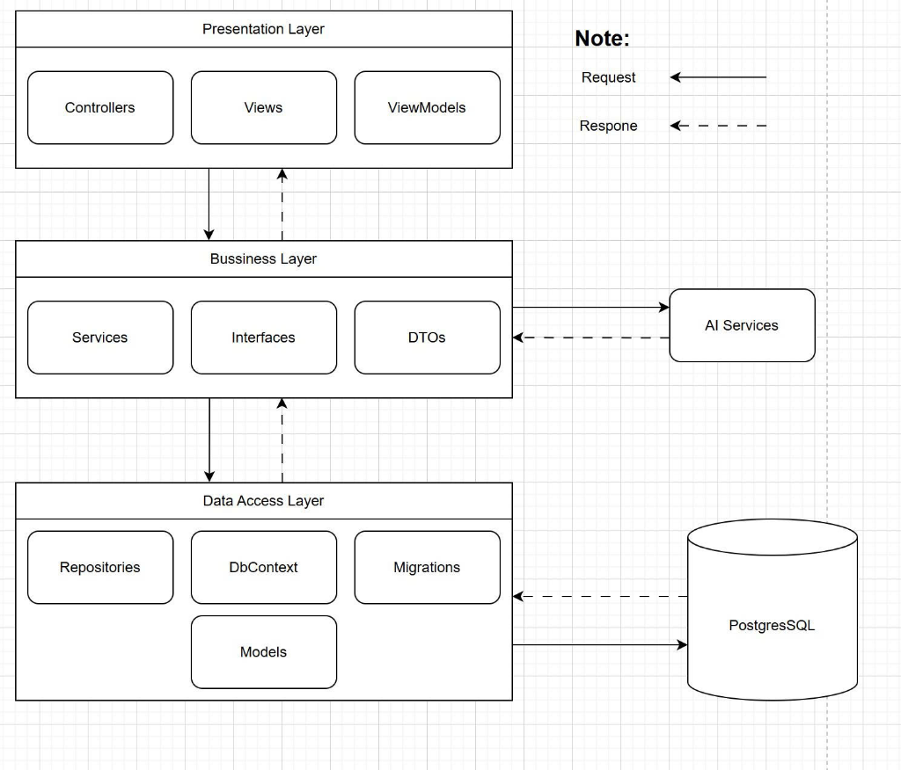

# ĐỒ ÁN MÔN HỌC: HỆ THỐNG QUẢN LÝ HỌC LIỆU VÀ TRỢ LÝ HỌC TẬP THÔNG MINH (STUDYMIND)
## KIẾN TRÚC TIÊU CHUẨN 3-LAYERS VÀ TÍCH HỢP AI TRÍ TUỆ NHÂN TẠO

---

## 📝 Giới thiệu dự án

**StudyMind** là hệ thống quản lý học liệu trực tuyến tích hợp trợ lý ảo thông minh (AI Chatbot) giúp sinh viên học tập, ôn luyện kiến thức trực tiếp từ tài liệu do Giảng viên cung cấp. Dự án được phát triển bằng công nghệ **ASP.NET Core MVC (.NET 8)**, sử dụng cơ sở dữ liệu **PostgreSQL** kết hợp **Entity Framework Core**, tuân thủ nghiêm ngặt mô hình thiết kế **3-Layers (Presentation - Business Logic - Data Access)**.

Hệ thống được thiết kế với giao diện hiện đại (Neo-Brutalist & Tailwind CSS), tối ưu hóa trải nghiệm người dùng, đồng thời đảm bảo các yếu tố bảo mật hệ thống cao cấp.

---

## 🏗️ Kiến trúc Hệ thống (3-Layers Architecture)

s

Dự án được phân rã thành các Project Class Library riêng biệt giúp tăng tính độc lập, dễ bảo trì và mở rộng:

1. **`DataAccessLayer (DAL)`**: 
   - Quản lý các Thực thể (Entities) dữ liệu tương ứng với các bảng trong PostgreSQL.
   - Quản lý kết nối cơ sở dữ liệu (`AppDbContext`) và Migration.
   - Triển khai mẫu thiết kế **Repository Pattern** để xử lý các truy xuất dữ liệu thô.
2. **`BussinessLayer (BLL)`**:
   - Nhận nhiệm vụ điều phối và xử lý toàn bộ logic nghiệp vụ (Services).
   - Giao tiếp trực tiếp giữa Presentation Layer và Data Access Layer thông qua các **DTOs (Data Transfer Objects)** để tránh lộ cấu trúc cơ sở dữ liệu gốc.
   - Tích hợp các dịch vụ bên thứ ba (Gemini AI API, Gửi Email qua SMTP).
3. **`PresentationLayer (PL)`**:
   - Dự án ASP.NET Core MVC phụ trách phần giao diện và tương tác người dùng.
   - Sử dụng **ViewModels** để chuyển đổi và validate dữ liệu từ Client gửi lên.
   - Cấu hình Dependency Injection (DI) toàn diện và nạp các biến môi trường từ tệp ẩn `.env`.

---

## ⚡ Các Tính Năng Cốt Lõi Đã Hoàn Thành

### 1. Phân quyền và Bảo mật (Authentication & Authorization)
- Sử dụng cơ chế **Cookie Authentication** kết hợp phân quyền theo vai trò (**Role-based Authorization**) chặt chẽ.
- Mật khẩu người dùng được băm an toàn cấp công nghiệp bằng thuật toán **BCrypt**.
- **Admin** có giao diện cấp tài khoản mới và gửi email chào mừng tự động chứa thông tin đăng nhập cho người dùng mới qua giao diện Memphis độc đáo.
- **Phân chia quyền hạn rõ rệt**:
  - `Student`: Chỉ truy cập không gian chat học tập AI, đăng ký gói dịch vụ và xem tài liệu. Không có quyền tải lên hay quản trị hệ thống.
  - `Lecturer`: Quản lý các tài liệu thuộc môn học được phân công (Upload thường, Upload Chunk, chỉnh sửa metadata tài liệu, xem các đoạn phân tách của tài liệu).
  - `Admin`: Quản lý toàn bộ người dùng, môn học, các gói Subscription, xem báo cáo doanh thu tài chính và chi tiết tài liệu (đọc nội dung chunk/embedding).

### 2. Client-Side Chunking & Xử lý Tải lên File lớn (Up to 50MB)
- Hệ thống hỗ trợ chia nhỏ các tệp lớn (PDF, DOCX, PPTX) thành các chunk **2MB** bằng JavaScript tại Client trước khi gửi tuần tự lên Server nhằm tránh nghẽn băng thông và lỗi Timeout.
- **Thanh tiến trình (Progress Bar)** cập nhật phần trăm hoàn thành theo thời gian thực.
- Tích hợp **Console Terminal giả lập** trực quan ngay trên giao diện upload để hiển thị log xử lý từ máy chủ (cắt tệp, tải mảnh, ghép tệp tạm, tính mã băm, ghi DB...).

### 3. Kiểm tra Trùng lặp Nội dung bằng SHA-256 (Deduplication)
- Sau khi ghép nối file hoàn chỉnh trên máy chủ, hệ thống tự động tính mã băm **SHA-256** của nội dung file.
- So khớp mã băm này với Cơ sở dữ liệu:
  - Nếu trùng SHA-256 (nội dung giống hệt file đã có), hệ thống sẽ từ chối lưu, xóa tệp tạm và hiển thị cảnh báo lỗi chi tiết trên Console của Client.
  - Cho phép tải lên các file cùng tên nhưng nội dung bên trong khác nhau.

### 4. Tự động Trích xuất Text & Xem Phân đoạn Tài liệu (AI Indexed Chunks)
- Tài liệu sau khi tải lên thành công sẽ **tự động chuyển trạng thái thành `Indexed`**.
- Hệ thống sử dụng **Gemini AI API** để trích xuất văn bản và phân tách nội dung tài liệu thành các phân đoạn nhỏ (theo trang đối với PDF, slide đối với PPTX, hoặc block ~1200 ký tự đối với Word/TXT).
- **Trang Chi tiết tài liệu** dành cho Admin và Giảng viên được tích hợp sẵn khung **AI Indexed Chunks** cho phép xem lại trực tiếp nội dung từng trang/phân đoạn tài liệu của tệp tin một cách trực quan trước khi đưa vào AI Training.

### 5. Thống kê Tài chính & Lịch sử Giao dịch
- Dashboard của Admin hiển thị biểu đồ chỉ số doanh thu thực tế và **Lợi nhuận ròng** (tự động khấu trừ 15% phí vận hành hệ thống).
- Bảng lịch sử giao dịch chi tiết truy vấn trực tiếp từ bảng `PaymentTransactions` (ghi nhận các giao dịch mua gói hội viên AI của Sinh viên qua cổng giả lập).

### 6. Quản lý Cấu hình Bảo mật qua `.env` (Zero-Config Security)
- Loại bỏ toàn bộ Connection Strings và Private Keys (như HashSecret của VNPay) khỏi file `appsettings.json`.
- Triển khai parser tự động đọc tệp `.env` ở thư mục gốc và thiết lập thành Process Environment Variables trước khi khởi chạy Host ứng dụng.
- Đảm bảo an toàn mã nguồn khi chia sẻ hoặc đưa lên các kho lưu trữ công cộng (GitHub).

---

## 🛠️ Công nghệ Sử Dụng

- **Backend**: .NET 8, C# ASP.NET Core MVC
- **Database**: PostgreSQL
- **ORM**: Entity Framework Core (EF Core 8)
- **Frontend**: Tailwind CSS, Vanilla JS, Font-Awesome Icons, Mammoth.js (để kết xuất file `.docx` trực tiếp trên trình duyệt)
- **AI Integration**: Google Gemini API (trích xuất text, sinh vector embeddings)
- **Bảo mật**: BCrypt.Net (băm mật khẩu), DotNetEnv (quản lý biến môi trường)

---

## ⚙️ Hướng dẫn Cài đặt & Khởi chạy dự án

### 1. Chuẩn bị tệp môi trường `.env`
Tạo một file đặt tên là `.env` ở thư mục gốc của dự án (cùng cấp với tệp `Assignment1.slnx`) với nội dung mẫu sau:

```env
# Kết nối PostgreSQL Database
DB_HOST=localhost
DB_PORT=5432
DB_DATABASE=Assignment1Db
DB_USERNAME=postgres
DB_PASSWORD=mật_khẩu_postgresql_của_bạn

# Cấu hình chuỗi kết nối chính thức
ConnectionStrings__DefaultConnection="Host=localhost;Port=5432;Database=Assignment1Db;Username=postgres;Password=mật_khẩu_postgresql_của_bạn"

# Cấu hình API Key (Nếu có sử dụng Gemini AI)
Gemini__ApiKey="API_KEY_GEMINI_CỦA_BẠN"

# Cấu hình cổng thanh toán VNPay
VNP_HASH_SECRET="MÃ_HASH_VNPAY_CỦA_BẠN"
```

### 2. Thực hiện Migration & Cập nhật Database
Mở Command Prompt hoặc Terminal tại thư mục gốc của dự án và chạy lệnh sau để tự động tạo cơ sở dữ liệu PostgreSQL và các bảng:

```bash
dotnet ef database update --project DataAccessLayer --startup-project PresentationLayer
```

### 3. Khởi chạy ứng dụng
Chạy ứng dụng từ thư mục `PresentationLayer`:

```bash
cd PresentationLayer
dotnet run
```

Mở trình duyệt và truy cập: `http://localhost:5000` hoặc địa chỉ HTTPS được cấp trên Console.

---

## 🔑 Tài khoản Thử nghiệm (Mẫu Seed Data)

Hệ thống đã nạp sẵn 3 tài khoản tương ứng với 3 nhóm vai trò khác nhau trong DB để giảng viên kiểm nghiệm:

*   **Tài khoản Quản trị (Admin)**:
    - Username: `admin`
    - Password: `admin123`
*   **Tài khoản Giảng viên (Lecturer)**:
    - Username: `lecturer`
    - Password: `lecturer123`
*   **Tài khoản Sinh viên (Student)**:
    - Username: `student`
    - Password: `student123`
